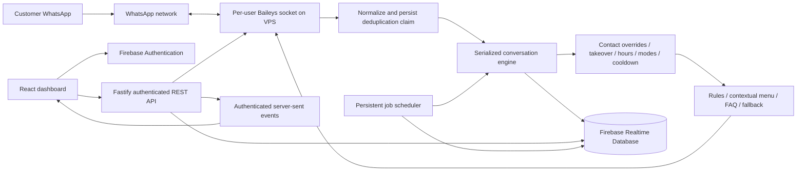

# Architecture

## Process ownership

One Node process owns all linked-device sockets, isolated by verified UID. Each context tracks connection status, QR expiry, retry count, generation, pending connection, retry timer, and socket. Generation checks reject stale connection events. Concurrent connect calls share a pending operation. Socket credentials live in per-user SHA-256 directories with mode 0700 and files with mode 0600. QR images are ephemeral in memory, delivered only through authenticated APIs/SSE. Firebase stores connection metadata, never session credentials.

Startup queries indexed connected/reconnecting tenants and restores their valid auth state. Temporary errors use bounded exponential retries (eight attempts, capped at 60 seconds plus jitter). Logout/invalid/replaced sessions terminate retries. Restart-required reconnects immediately after a brief delay. Disconnect keeps credentials; logout deletes that user's credentials. Run exactly one PM2 fork instance: multiple owners of a linked-device session are unsupported.

## Processing

The engine queues work per user/chat. A Firebase transaction claims a persistent chat/message key before processing. Normalized incoming records are stored even when automation is globally paused. Groups are ignored unless explicitly enabled. Contacts are auto-created, unread counts updated, pending follow-ups cancelled, and daily UTC aggregates incremented.

VIP/ignored/blocked preferences and first-time-only rules gate automation. Human requests are detected before schedule/cooldown decisions, pause the conversation, and send one acknowledgement. Business hours use the configured IANA timezone with inclusive opening and exclusive closing; overnight periods carry into the next day. Enabled holiday entries override an entire local calendar date with closure or special hours, replacing incoming overnight hours. Holiday closures also defer follow-ups, and optional holiday responses replace the default closed-hours message. Modes, context-bound numbered menus, deterministic priority rules, catalog item/name/keyword answers, FAQ answers, new-contact welcome, and fallback follow in that order.

Per-reason and global conversation cooldowns are persisted before transport. Outgoing messages store a pending intent before send and become sent/failed after transport. Auto replies and manual replies are visually differentiated. WhatsApp message receipt updates feed delivery state when available. Unsupported media is metadata only, not downloaded or stored as raw protocol objects.

## Reliability semantics

WhatsApp and Firebase cannot share an atomic transaction. This release favors avoiding duplicate customer replies: once processing or a send request is claimed, ambiguous failures are not automatically retried. A process crash between claim and send can leave an unanswered message or pending record. Inspect Activity Logs and manually respond. This is **at-most-once processing**, not a guarantee of exactly-once delivery. Seven-day deduplication retention covers normal repeated `notify` events; history-sync append events are excluded. A durable transactional outbox with reconciliation is the next step for stronger delivery guarantees.

The scheduler runs each minute, claims due jobs, verifies current global/chat state, and sends one follow-up during open hours. A customer reply cancels pending follow-ups. It processes the oldest due jobs first, archives finished/cancelled jobs, expires job history after 30 days, and cleans expired dedupe/request/job claims and expired menu state in bounded batches. Conversation and log retention is not silently destructive. Operations currently use bounded 200-record configuration reads; split configuration indexing and cursor pagination further before supporting workspaces with larger automation libraries.

## Boundaries

`packages/shared` contains runtime schemas and models. The frontend owns display and form state; the server owns validation, authentication, transport, persistence, aggregate writes, and engine decisions. `FallbackResponder` is an optional extension point; V1 does not call an AI provider. `Store` separates application code from Firebase operations. The replaceable SessionStorage interface uses local files for the initial single-instance deployment; a dedicated encrypted remote auth-state adapter and distributed socket ownership are necessary before scaling horizontally.

No payment/subscription service or superadmin is included. The linked-device transport is Baileys 7.0.0-rc14 as resolved by this build; it is not the official Meta Business API. Live behavior depends on the upstream protocol. Keep the lockfile and verify upgrades in a test account.
